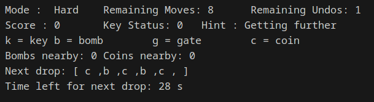
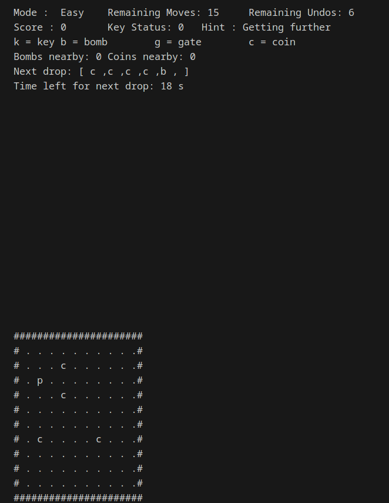
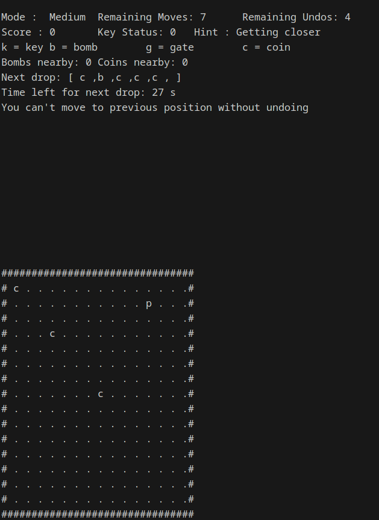
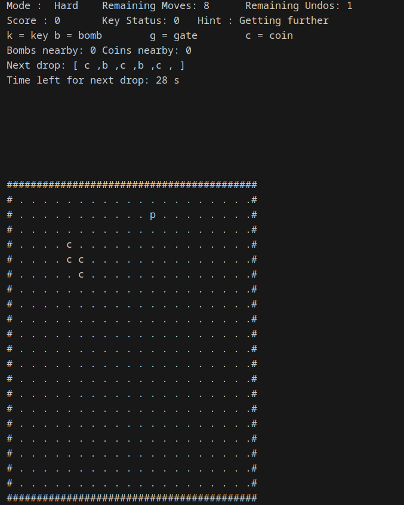
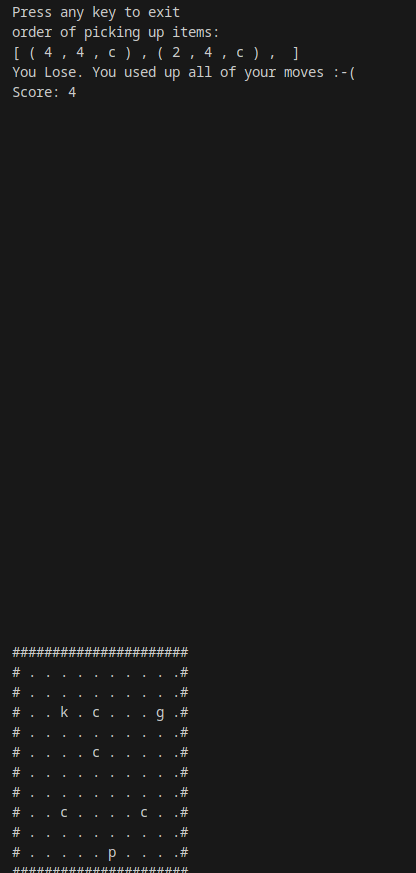
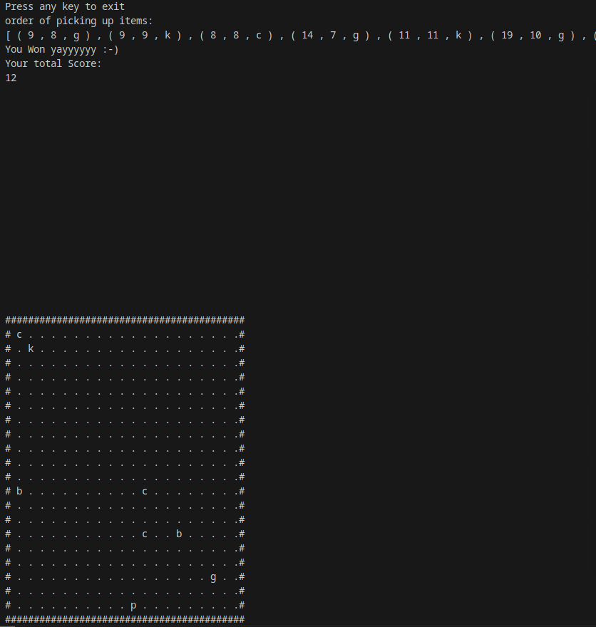

# Version 4.1 Final (Hopefully)

## Running the Game:
To run the game, execute the following commands in your Linux terminal within the working directory:

```bash
g++ -o game game.cpp -lncurses
./game
```

You must have lncurses installed on your system.

## Playing the Game:
The game is not case sensitive, i.e., inputting w is the same as W.\

### Controls:
- Move up: `w`, up arrow key
- Move down: `s`, down arrow key
- Move left: `a`, left arrow key
- Move right: `d`, right arrow key
- Quit: `ESC` or `q`
- Undo move: `u`

## Rules:
- The player is blind and can only sense their surroundings within the maze.
- The goal is to navigate through the maze, find a hidden key, and unlock the exit door, both randomly placed.
- The player cannot see the key or door but can sense whether they're getting closer or further from the key.
- There is an \"undo\" feature that allows limited backtracking.
- The player can gather visible coins, and the game scales across three difficulty levels.

## Implementation:

### Classes:
- **Grid**: Stores the state of the game in the grid.
- **Game**: Controls player input and modifies the game state.
- **ItemQueue**: Manages items placed in the grid and the next items to spawn. Two instances of this class are used in `Game`. Every 30 seconds, an item is removed from the grid and a new one is added at a random coordinate from the `nextItems` queue. Another item is enqueued to `nextItems`.
- **CoordinateQueue**: Stores the coordinates and names of picked items, displayed at the end of the game.
- **MoveStack**: Stores the player's last moves. When `u` is pressed, the player moves back to the last position (if possible).

## Features:

### Menu:
Displays necessary information about the game state.



### Sensing Ability:
The player cannot see the key or gate but can sense whether they're getting closer to the key or gate.
I've improved this sensing ability by adding the exact direction of the gate and key when they're one block away
Furthermore the player can sense the number of bombs nearby to avoid them 

### Undoing moves:
The player can't go back to the previous position but can go back using the undo feature. Each difficulty level has different undo moves

### Bombs:
Bombs are hidden but can be sensed. The probability of a bomb spawning is 25%.

### Coins:
Coins are visible but can also be sensed. The probability of a coin spawning is 75%.

### Score:
- Each unused move equals 1 point
- each coin collected equals 2 points and 1 additional undo move

### Levels:
The game has three levels:

- **Easy**



- **Medium**



- **Hard**



## Game Ending Conditions:
- **Game Over**: If you step on a bomb or run out of moves.



- **Game Won**: If you pass all the levels.

